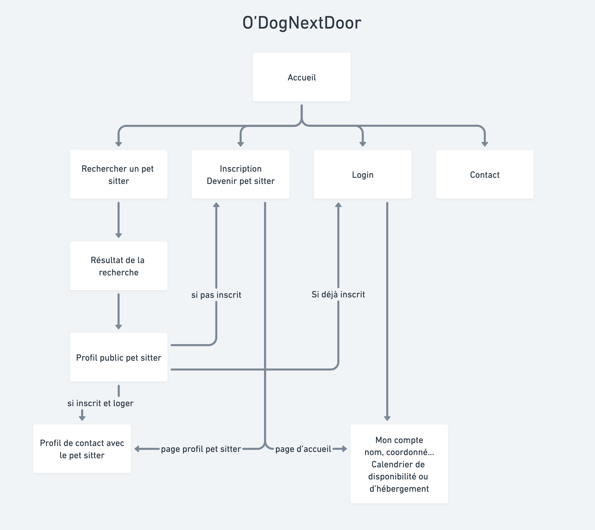

# Cahier des charges

## CDC : contenu - Présentation du projet

Site de mise en relation entre particuliers ayant chacun un animal de compagnie à faire garder.
Le but principal est de mettre en place un planning de garde alternée pour les chiens et chats (le but n'est pas de trouver un babysitter d'animaux qui propose un service, mais plutôt de faire de la garde partagée pour que les chiens aient toujours une personne et un collègue à leurs côtés).

Les personnes pourront chacun leur tour venir déposer leur animal chez une personne à la date prévue et le récupérer une fois la période écoulée, puis d'inverser les rôles sur une autre période selon les disponibilités des personnes en accords.
Ce planning peut être ponctuel, quotidien, mensuel... et engager plusieurs personnes.

Les principaux objectifs seraient :

1. la recherche d'accueillants,
2. la mise en relation,
3. l'édition d'un planning,

D'autres options tels que les activités canines proposées par les accueillants, un système de notation et d'avis, d'ajout de favoris, de messagerie instantanée (webscoket) , de mail de rappel, de partage de photo sur le profil...(ou toute autre idée d'amélioration) pourraient être intégrées selon le temps disponible et si le niveau technique le permet.

## Les Fonctionnalités

### MVP

1. Rechercher un pet sitter se situant dans la même ville ou région
2. Devenir un pet sitter
3. Discuter avec un pet sitter en privée ( messagerie)
4. Proposer un créneau de disponibilité
5. Réservez un créneau de garde
6. Validation de la garde
7. Mettre à jour le planning

### Evolutions potentielles

1. Recherche de pet sitter par périmètre affichage de la carte (API : googleMap, OpenLayers, leaflet, mapbox, openstreetview)
2. Rendre la garde obligatoire après avoir fait garder son animal
3. Gestion d'une monnaie virtuelle avec le Doggy
4. Acheter des Doggy's
5. Ajout du web socket (discussion instantanée)

### Liste des technologie

- React
- Redux Toolkit
- Express
- Postgresql
- Nodejs

### Public visé

- Personne majeur qui ont un animal de compagnie
- Personne majeur qui peut heberger l'animal d'une autre personne

### Navigateurs compatible

- Google Chrome
- Safari
- Firefox

### L'arborescence de l'application

### Liste des routes prévues

| Route | Méthode | Action | Données renvoyées |
|---------------|---------|------------------------------|-----------------|
| `/` | GET | Affichage du formulaire & homepage | Page d'accueil
| `/` | POST | Soumission du formulaire de recherche | Information retournée par le formulaire
| `/subscribe` | GET | Affichage du formulaire d'inscription | Page d'inscription
| `/subscribe` | POST | Soumission du formulaire d'inscription | Information du nouvelle utilisateur
| `/login` | GET | Affichage du formulaire de connexion | Page de connexion
| `/login` | POST | Soumission du formulaire de connexion | Connexion de l'utilisateur
| `/contact` | GET | Affichage du formulaire de contact | Page de contact
| `/contact` | POST | Soumission du formulaire de contact | Envoi d'un message à l'administrateur
| `/account` | GET | Affichage du profil de l'utilisateur | Récupérer les données du profil
| `/account` | PATCH | Modification du calendrier | Modifier le calendrier
<!-- Route profil à faire sur arbo -->
| `/profil` | GET | Affichage des informations personnelles de l'utilisateur | Récupére les données personnels de l'utilisateur
| `/profil` | PATCH | Modification du profil | Modifier du profil
<!-- Fin route de profil -->
| `/search` | GET | Liste des utilisateurs | Récupère les utilisateurs des doggers proches et afficher sur la map
| `/search` | POST | Refaire une recherche | Modifiez le filtre de recherche 
| `/pet-sitter` | GET | Affichage du pet sitter | Récupère la page de profil du pet sitter
| `/booking` | GET | Affichage du formulaire de réservation | Formulaire de réservation
| `/booking` | POST | Soumission de formulaire de réservation | Demande de réservation 
<!-- Route Inbox à faire sur arborescence -->
| `/inbox` | GET | Liste des demandes en attente | Affichage des demandes en attentes
| `/inbox/in-progress` | GET | Liste des demandes en cours | Affichage des demandes en cours
| `/inbox/passed` | GET | Liste des demandes passées | Affichage des demandes passées
| `/inbox/upcoming` | GET | Liste des demandes à venir | Affichage des demandes à venir
<!-- Fin de  route inbox-->

### User stories

### Rôle de chacun

## Documents relatifd à la BDD

