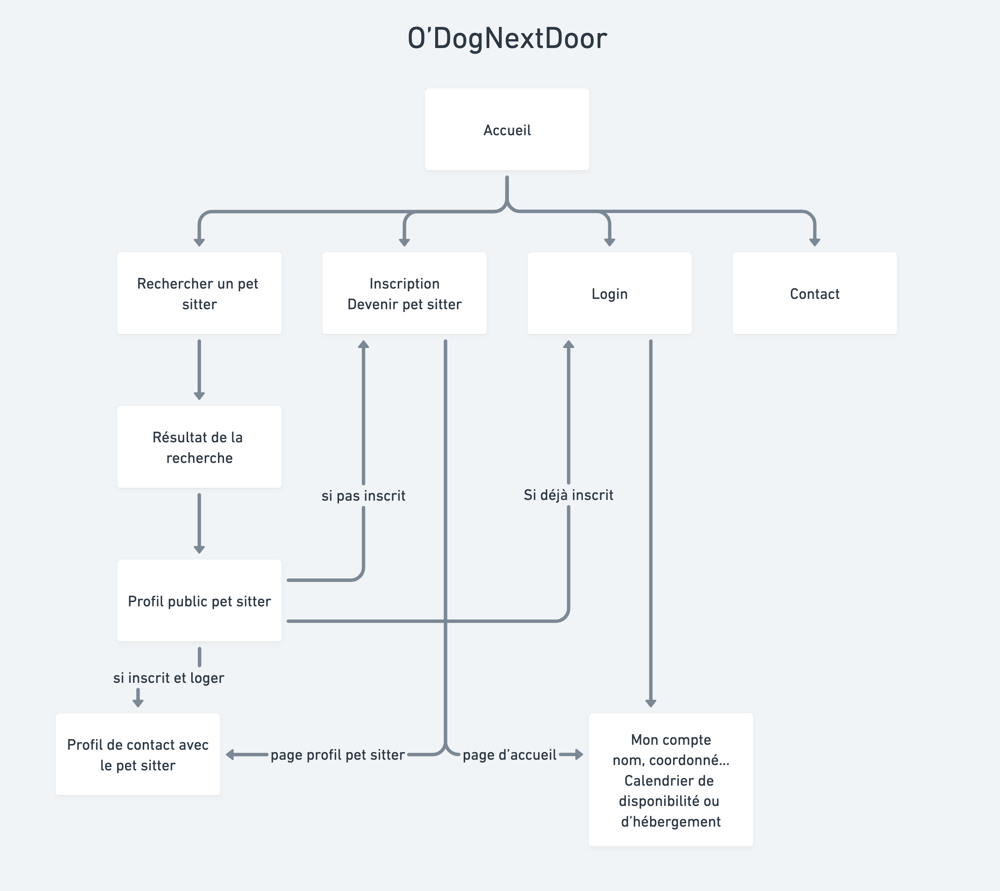
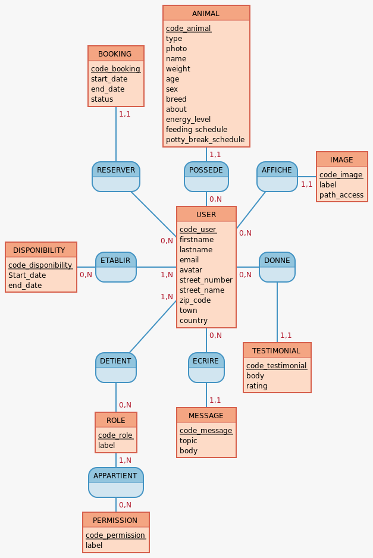
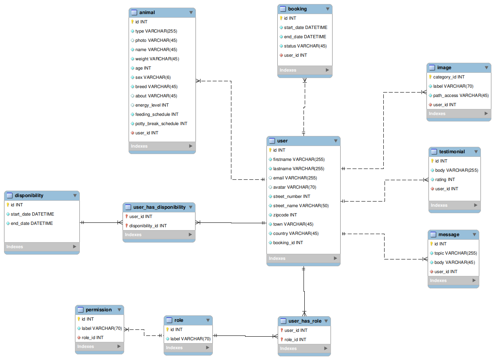

# Cahier des charges

## CDC : contenu - Présentation du projet

Site de mise en relation entre particuliers ayant chacun un animal de compagnie à faire garder.
Le but principal est de mettre en place un planning de garde alternée pour les chiens et chats (le but n'est pas de trouver un babysitter d'animaux qui propose un service, mais plutôt de faire de la garde partagée pour que les chiens aient toujours une personne et un collègue à leurs côtés).

Les personnes pourront chacun leur tour venir déposer leur animal chez une personne à la date prévue et le récupérer une fois la période écoulée, puis d'inverser les rôles sur une autre période selon les disponibilités des personnes en accords.
Ce planning peut être ponctuel, quotidien, mensuel... et engager plusieurs personnes.

Les principaux objectifs seraient :

1. la recherche d'accueillants,
2. la mise en relation,
3. l'édition d'un planning,

D'autres options tels que les activités canines proposées par les accueillants, un système de notation et d'avis, d'ajout de favoris, de messagerie instantanée (webscoket) , de mail de rappel, de partage de photo sur le profil...(ou toute autre idée d'amélioration) pourraient être intégrées selon le temps disponible et si le niveau technique le permet.

## Les Fonctionnalités

## MVP

1. Rechercher un pet sitter se situant dans la même ville ou région
2. Devenir un pet sitter
3. Discuter avec un pet sitter en privée ( messagerie)
4. Proposer un créneau de disponibilité
5. Réservez un créneau de garde
6. Validation de la garde
7. Mettre à jour le planning

## Evolutions potentielles

1. Recherche de pet sitter par périmètre affichage de la carte (API : googleMap, OpenLayers, leaflet, mapbox, openstreetview)
2. Rendre la garde obligatoire après avoir fait garder son animal
3. Gestion d'une monnaie virtuelle avec le Doggy
4. Acheter des Doggy's
5. Ajout du web socket (discussion instantanée)
6. Modification du mot de passe en cas d'oubli
7. Avoir un panel d'administration pour gérer tous les utilisateurs

## Liste des technologie

- React
- Redux Toolkit
- Express
- Postgresql
- Nodejs

## Public visé

- Personne majeur qui ont un animal de compagnie
- Personne majeur qui peut heberger l'animal d'une autre personne

## Navigateurs compatible

- Google Chrome
- Safari
- Firefox

## L'arborescence de l'application

### Liste des routes prévues

| Route | Méthode | Action | Données renvoyées |
|---------------|---------|------------------------------|-----------------|
|Routes Utilisateurs|---|---|---|
| `/` | GET | Affichage du formulaire & homepage | Page d'accueil
| `/` | POST | Soumission du formulaire de recherche | Information retournée par le formulaire
| `/subscribe` | GET | Affichage du formulaire d'inscription | Page d'inscription
| `/subscribe` | POST | Soumission du formulaire d'inscription | Information du nouvelle utilisateur
| `/login` | GET | Affichage du formulaire de connexion | Page de connexion
| `/login` | POST | Soumission du formulaire de connexion | Connexion de l'utilisateur
| `/contact` | GET | Affichage du formulaire de contact | Page de contact
| `/contact` | POST | Soumission du formulaire de contact | Envoi d'un message à l'administrateur
| `/search` | GET | Liste des utilisateurs | Récupère les utilisateurs des doggers proches et afficher sur la map
| `/search` | POST | Refaire une recherche | Modifiez le filtre de recherche 
|Routes membres|---|---|---|
| `/account` | GET | Affichage du profil de l'utilisateur | Récupérer les données du profil
| `/account` | PATCH | Modification des données personnelles (prénom, email, téléphone) | Modifier les données personnelles (prénom, email, téléphone)
| `/inbox` | GET | Liste des demandes en attente, en cours, à venir et passées | Affichage des demandes en attente, en cours, à venir et passées
| `/pet-sitter` | GET | Affichage du pet sitter | Récupère la page de profil du pet sitter
| `/pet-sitter` | PATCH | Modification du profil pet sitter  | Modification du calendrier et des commentaires

## User stories

### Route : acceuil (/) 
| En tant que  | Je veux que | Afin de  |
|---------------|---------|------------------------------|
|  utilisateur  |  pouvoir rechercher des pet sitter disponibles dans une ville spécifique et pour des dates précises  |   planifier l'hébergement de mon animal  |

### Route : search (/search)
| En tant que  | Je veux que | Afin de  |
|---------------|---------|------------------------------|
|  utilisateur  |  filtrer les résultats de ma recherche en fonction de critères tels que la disponibilité, le profil du pet sitter, les avis des clients  |   afin de trouver l'hébergement qui correspond le mieux à mes besoins.  |

### Route : subscribe (/subscribe)
| En tant que  | Je veux que | Afin de  |
|---------------|---------|------------------------------|
|  utilisateur  |  je veux pouvoir m'inscrire  |  pour pouvoir faire garder mon animal ou héberger un animal  |

### Route : Login (/login)
| En tant que  | Je veux que | Afin de  |
|---------------|---------|------------------------------|
|  membre  |  je veux pouvoir me connecter à mon compte en utilisant mon adresse e-mail et mon mot de passe  |  accéder à mes réservations et à d'autres fonctionnalités personnalisées du site  |

### Route : contact (/contact)
| En tant que  | Je veux que | Afin de  |
|---------------|---------|------------------------------|
|  utilisateur   |  je veux pouvoir contacter l'administrateur du site  |  afin de demander des information conplémentaire  |

### Route : account (/account)
| En tant que  | Je veux que | Afin de  |
|---------------|---------|------------------------------|
|  membre  |  je souhaite pouvoir modifier mes données personnels | mettre à jour mon profil et mes réservations |

### Route : inbox (/inbox)
| En tant que  | Je veux que | Afin de  |
|---------------|---------|------------------------------|
|  membre  |  je souhaite avoir accès à un espace personnel où je peux gérer mes réservations passées et à venir, ainsi que consulter l'historique de mes séjours  |  ""  |
|  membre  |  je veux avoir une confirmation de ma réservation  | comprenant tous les détails de ma réservation  |
|  membre  |  je veux avoir la possibilité de modifier ou d'annuler ma réservation en ligne  |  en respectant les conditions d'annulation   |
|  membre  |  je souhaite être informer de mes demandes en attente   |  pouvoir répondre et valider ou non les demandes d'hébergements  |

### Route : pet-sitter (/pet-sitter)
| En tant que  | Je veux que | Afin de  |
|---------------|---------|------------------------------|
|  utilisateur  |  je veux pouvoir consulter les détails de chaque pet sitter  |   y compris les photos, l'hébergement, et les commentaires des clients, pour prendre une décision éclairée |
|  membre  |  je souhaite pouvoir contacter un pet sitter  |  pour avoir des informations complémentaires  |
|  membre  |  je souhaite pouvoir donner mon avis  |  pour évaluer un pet sitter  |
|  membre  |  je souhaite pouvoir réserver un créneau chez un pet sitter  |  faire garder mon animal   |

## Rôle de chacun

- Product owner : Ilias YAKDANE
- Scrum master : 
- Lead dev : 
- Git master : 
- Référent tech : 
    - API.gouv / vicolo :
    - react-calendar 
    - Leaflet / Google Map / HERE : 

## Documents relatif à la BDD

### MCD 
- user : code_user, firstname, lastname, email, avatar, street_number, street_name, zip_code, town, country
- role : code_role, label 
- permission : code_permission, label
- animal : code_animal, type, photo, name, weight, age, sex, breed, about, energy level, feeding schedule, potty break schedule
- message : code_message, topic, body
- testimonial : code_testimonial, body, rating
- image : code_image, label, path_access
- planning : code_planning,  : code_planning, started_date, ended_date
- booking : code_booking, start_date, ended_date, status

### Le MPD

### Dico des données

##### Table animal

- id
- type
- photo
- name
- weight
- age
- sex
- breed
- about
- energy_level
- feeding schedule
- potty_break_schedule

##### Table booking

- id
- start_date
- end_date
- status

##### Table disponibility

- id
- Start_date
- end_date

##### Table image

- id
- label
- path_access

##### Table message

- id
- topic
- body

##### Table permission

- id
- label

##### Table testimonial

- id
- label
- code_testimonial
- body
- rating

##### Table user

- id
- firstname
- lastname
- email
- avatar
- street_number
- street_name
- zip_code
- town
- country