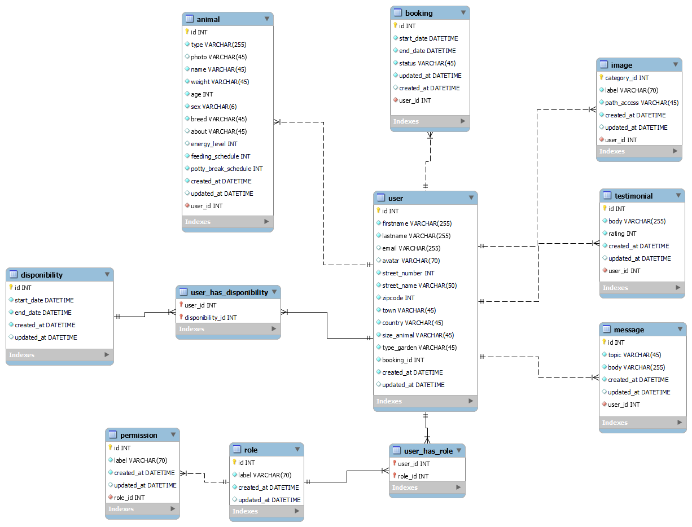

# Cahier des charges

## CDC : contenu - Présentation du projet

Site de mise en relation entre particuliers ayant chacun un animal de compagnie à faire garder.
Le but principal est de mettre en place un planning de garde alternée pour les chiens et chats (le but n'est pas de trouver un babysitter d'animaux qui propose un service, mais plutôt de faire de la garde partagée pour que les chiens aient toujours une personne et un collègue à leurs côtés).

Les personnes pourront chacun leur tour venir déposer leur animal chez une personne à la date prévue et le récupérer une fois la période écoulée, puis d'inverser les rôles sur une autre période selon les disponibilités des personnes en accords.
Ce planning peut être ponctuel, quotidien, mensuel... et engager plusieurs personnes.

Les principaux objectifs seraient :

1. la recherche d'accueillants,
2. la mise en relation,
3. l'édition d'un planning,

D'autres options tels que les activités canines proposées par les accueillants, un système de notation et d'avis, d'ajout de favoris, de messagerie instantanée (webscoket) , de mail de rappel, de partage de photo sur le profil...(ou toute autre idée d'amélioration) pourraient être intégrées selon le temps disponible et si le niveau technique le permet.

## Les Fonctionnalités

## MVP

1. Rechercher un pet sitter se situant dans la même ville ou région
2. Recherche de pet sitter par périmètre, affichage de la carte (API : leaflet, api.gouv)
3. Devenir un pet sitter
4. Discuter avec un pet sitter en privée (messagerie)
5. Proposer un créneau de disponibilité
6. Réservez un créneau de garde
7. Validation de la garde
8. Mettre à jour le planning

## Evolutions potentielles

2. Rendre la garde obligatoire après avoir fait garder son animal
3. Gestion d'une monnaie virtuelle avec le Doggy
4. Acheter des Doggy's
5. Ajout du web socket (discussion instantanée & planning)
6. Modification du mot de passe en cas d'oubli
7. Avoir un panel d'administration pour gérer tous les utilisateurs

## Liste des technologie

- React
- Redux Toolkit
- Express
- Postgresql
- Nodejs

## Public visé

- Personne majeur qui ont un animal de compagnie
- Personne majeur qui peut heberger l'animal d'une autre personne

## Navigateurs compatible

- Google Chrome
- Safari
- Firefox

## L'arborescence de l'application

### Liste des routes : front

| Route | Page |
|---------------|---------|
|Routes Utilisateurs|---|---|---|
| `/` | Affichage homepage & formulaire de rechreche avec possiblité de soumettre pour effectuer la recherche |
| `/subscribe` | Affichage du formulaire d'inscription avec possibilité de soumettre pour se créer un compte |
| `/contact` | Affichage du formulaire de contact avec possibilité de soumettre pour envoyer la demande aux administrateurs du site |
| `/login` | Affichage du formulaire de connexion avec possibilité de soumettre pour connexion|
| `/search` | Affiche la liste des utilisateurs trouvés selon les ccritères de recherche |
|Routes membres|---|
| `/pet-sitter/id` | Affichage du pet sitter sélectionné par l'id |
| `/pet-sitter/id/reservation` | Envoyer une demande de réservation au pet-sitter correspondant |
| `/account/id` | Affichage du profil de l'utilisateur loggé avec son compte |
| `/account/id/addanimal` | Ajout d'un animal au pet-sitter correspondant |
| `/account/id/inbox` | Affcihage de la liste des demandes en attentes |
| `/account/id/inbox/upcoming` | Affcihage de la liste des demandes à venir  |
| `/account/id/inbox/past` | Affcihage de la liste des demandes passées |

### Liste des routes : back

| Route | Méthode | Action | Données renvoyées |
|---------------|---------|------------------------------|-----------------|
|Routes Utilisateurs|---|---|---|
| `/` | GET | Affichage du formulaire & homepage | Page d'accueil|
| `/` | POST | Soumission du formulaire de recherche | Information retournée par le formulaire|
| `/subscribe` | GET | Affichage du formulaire d'inscription | Page d'inscription|
| `/subscribe` | POST | Soumission du formulaire d'inscription | Information du nouvelle utilisateur|
| `/login` | GET | Affichage du formulaire de connexion | Page de connexion|
| `/login` | POST | Soumission du formulaire de connexion | Connexion de l'utilisateur|
| `/contact` | GET | Affichage du formulaire de contact | Page de contact|
| `/contact` | POST | Soumission du formulaire de contact | Envoi d'un message à l'administrateur|
| `/search` | GET | Liste des utilisateurs | Récupère les utilisateurs des doggers proches et afficher sur la map|
| `/search` | POST | Refaire une recherche | Modifiez le filtre de recherche |
|Routes membres|---|---|---|
| `/account/:id` | GET | Affichage du profil de l'utilisateur | Récupérer les données du profil|
| `/account/:id` | PATCH | Modification des données personnelles (prénom, email, téléphone) | Modifier les données personnelles |
| `/account/:id/addanimal` |GET | Affichage du formulaire d'ajoute d'animal | / |
| `/account/:id/addanimal` |POST | Envoie du formulaire d'ajoute d'animal | Données concernant l'animal |
| `/inbox` | GET | Liste des demandes en attente, en cours, à venir et passées | Affichage des demandes en attente, en cours, à venir et passées|
| `/pet-sitter/:id` | GET | Affichage du pet sitter | Récupère la page de profil du pet sitter|
| `/pet-sitter/:id` | PATCH | Modification du profil pet sitter  | Modification du calendrier et des commentaires|
| `/pet-sitter/:id/reservation` | GET | Affichage du formulaire de réservation | Afficher les informations de l'utilisateur qui réserve avec animal et du pet sitter |
| `/pet-sitter/:id/reservation` | POST | Enoive du formulaire de réservation | Envoyer des données de réservation |

| `/account/:id/inbox` |GET | Affichage du formulaire & homepage | Affcihage de la liste des demandes en attentes |
| `/account/:id/inbox/upcoming` |GET | Affichage du formulaire & homepage | Affcihage de la liste des demandes à venir  |
| `/account/:id/inbox/past` |GET | Affichage du formulaire & homepage | Affcihage de la liste des demandes passées |

## User stories

### Route : acceuil (/) 
| En tant que  | Je veux que | Afin de  |
|---------------|---------|------------------------------|
|  utilisateur  |  pouvoir rechercher des pet sitter disponibles dans une ville spécifique et pour des dates précises  |   planifier l'hébergement de mon animal  |

### Route : search (/search)
| En tant que  | Je veux que | Afin de  |
|---------------|---------|------------------------------|
|  utilisateur  |  filtrer les résultats de ma recherche en fonction de critères tels que la disponibilité, le profil du pet sitter, les avis des clients  |   afin de trouver l'hébergement qui correspond le mieux à mes besoins.  |

### Route : subscribe (/subscribe)
| En tant que  | Je veux que | Afin de  |
|---------------|---------|------------------------------|
|  utilisateur  |  je veux pouvoir m'inscrire  |  pour pouvoir faire garder mon animal ou héberger un animal  |

### Route : Login (/login)
| En tant que  | Je veux que | Afin de  |
|---------------|---------|------------------------------|
|  membre  |  je veux pouvoir me connecter à mon compte en utilisant mon adresse e-mail et mon mot de passe  |  accéder à mes réservations et à d'autres fonctionnalités personnalisées du site  |

### Route : contact (/contact)
| En tant que  | Je veux que | Afin de  |
|---------------|---------|------------------------------|
|  utilisateur   |  je veux pouvoir contacter l'administrateur du site  |  afin de demander des information conplémentaire  |

### Route : account (/account)
| En tant que  | Je veux que | Afin de  |
|---------------|---------|------------------------------|
|  membre  |  je souhaite pouvoir modifier mes données personnels | mettre à jour mon profil et mes réservations |

### Route : inbox (/inbox)
| En tant que  | Je veux que | Afin de  |
|---------------|---------|------------------------------|
|  membre  |  je souhaite avoir accès à un espace personnel où je peux gérer mes réservations passées et à venir, ainsi que consulter l'historique de mes séjours  |  ""  |
|  membre  |  je veux avoir une confirmation de ma réservation  | comprenant tous les détails de ma réservation  |
|  membre  |  je veux avoir la possibilité de modifier ou d'annuler ma réservation en ligne  |  en respectant les conditions d'annulation   |
|  membre  |  je souhaite être informer de mes demandes en attente   |  pouvoir répondre et valider ou non les demandes d'hébergements  |

### Route : pet-sitter (/pet-sitter)
| En tant que  | Je veux que | Afin de  |
|---------------|---------|------------------------------|
|  utilisateur  |  je veux pouvoir consulter les détails de chaque pet sitter  |   y compris les photos, l'hébergement, et les commentaires des clients, pour prendre une décision éclairée |
|  membre  |  je souhaite pouvoir contacter un pet sitter  |  pour avoir des informations complémentaires  |
|  membre  |  je souhaite pouvoir donner mon avis  |  pour évaluer un pet sitter  |
|  membre  |  je souhaite pouvoir réserver un créneau chez un pet sitter  |  faire garder mon animal   |

## Rôle de chacun

- Product owner : Ilias YAKDANE
- Scrum master : IBNAICHE Soufiane
- Lead dev : front : Karina ZAKHARIAN / back : Ilias YAKDANE
- Git master : David VIAU
- Référent tech : Soufiane IBNAICHE / David VIAU

## Documents relatif à la BDD

### MCD 
- user : code_user, firstname, lastname, email, avatar, street_number, street_name, zip_code, town, country
- role : code_role, label 
- permission : code_permission, label
- animal : code_animal, type, photo, name, weight, age, sex, breed, about, energy level, feeding schedule, potty break schedule
- message : code_message, topic, body
- testimonial : code_testimonial, body, rating
- image : code_image, label, path_access
- planning : code_planning,  : code_planning, started_date, ended_date
- booking : code_booking, start_date, ended_date, status

### Le MPD

### Dico des données

##### Table animal

| Champ | Type  | Spécifités | Description |
|---------|---------|---------|---------|
| id | INTEGER | PRIMARY KEY, NOT NULL, AUTO_INCREMENT | Identifiant de l'animal |
| type | VARCHAR(255) | NOT NULL | espèce de l'animal :chien ou chat |
| photo | VARCHAR(45) | NOT NULL, UNIQUE | image de l'animal, chemin accès à la photo |
| name | VARCHAR(45) | NOT NULL | nom de l'animal |
| weight_category | VARCHAR(45) | - | Categorie de poids de l'animal |
| age | DATE | - | Date de naissance de l'animal |
| sex | VARCHAR(6) | mâle ou femelle | sexe de l'animal |
| breed | VARCHAR(45) | - |  race de l'animal |
| about | LONGTEXT | - | description de l'animal |
| energy_level | INTEGER | - |  niveau d'activité/dépense de l'animal |
| feeding_schedule | INTEGER ou TIME? | NOT NULL |  créneau d'alimentation |
| potty_break_schedule | INTEGER ou TIME? | - |  créneau concernant les besoins |
| user_id | INTEGER | NOT NULL, FOREIGN KEY user(id) |  clé étrangère désigant le propriétaire (user) de l'animal |

##### Table booking

| Champ | Type  | Spécifités | Description |
|---------|---------|---------|---------|
| id | INTEGER | PRIMARY KEY, NOT NULL, AUTO_INCREMENT | Identifiant de la réservation |
| start_date | DATETIME | NOT NULL, UNIQUE | Date à laquelle la réservation commence |
| end_date | DATETIME | NOT NULL, UNIQUE, GreaterThan start_date | Date à laquelle la réservation prend fin |
| status | VARCHAR(45) | NOT NULL, DEFAULT "En ATTENTE" | Statut de la réservation : en attente, acceptée, finie |
| user_id | INTEGER | NOT NULL, FOREIGN KEY user(id) | Clé étrangère référant à l'utilisateur qui aura en charge l'hébergement |
| sender_id | INTEGER | NOT NULL, FOREIGN KEY user(id) | Clé étrangère référant à l'utilisateur qui fait la demande |

##### Table disponibility

| Champ | Type  | Spécifités | Description |
|---------|---------|---------|---------|
| id | INTEGER | PRIMARY KEY, NOT NULL, AUTO_INCREMENT | Identifiant de la disponibilité |
| start_date | DATETIME | NOT NULL, UNIQUE |  Date de début de disponibilité |
| end_date | DATETIME | NOT NULL, UNIQUE, GreaterThan start_date | Date de fin de disponibilité |

##### Table image

| Champ | Type  | Spécifités | Description |
|---------|---------|---------|---------|
| id | INTEGER | PRIMARY KEY, NOT NULL, AUTO_INCREMENT | Identifiant de l'image |
| label | VARCHAR(70) | NOT NULL | Libellé de l'image |
| path_access | VARCHAR(45) | NOT NULL | Chemin d'accès de l'image : sotckée dans répertoire public |
| user_id | INT |  FOREIGN KEY user(id)| Clé étrangère référant à l'utilisateur qui a ajouté une photo |

##### Table message

| Champ | Type  | Spécifités | Description |
|---------|---------|---------|---------|
| id | INTEGER | PRIMARY KEY, NOT NULL, AUTO_INCREMENT |  Identifiant du message |
| topic | VARCHAR(45) | NOT NULL | Sujet du message |
| body | LONGTEXT | NOT NULL | Contenu du message |
| recipient_id | INTEGER | NOT NULL, FOREIGN KEY user(id) |  Clé étrangère liée au destinataire du message |
| sender_id | INTEGER | NOT NULL, FOREIGN KEY user(id) |  Clé étrangère liée au l'expéditeur du message |

##### Table permission

| Champ | Type  | Spécifités | Description |
|---------|---------|---------|---------|
| id | INTEGER | PRIMARY KEY, NOT NULL, AUTO_INCREMENT | Identification de la permission |
| label | VARCHAR(70) | NOT NULL | Désignation de la permission |
| role_id | INTEGER | FOREIGN KEY role(id)| Clé étrangère lié à la permission |

##### Table testimonial

| Champ | Type  | Spécifités | Description |
|---------|---------|---------|---------|
| id | INTEGER | PRIMARY KEY, NOT NULL |  |
| body | VARCHAR(255)   | NOT NULL  | corps du message |
| rating | INTEGER   | NOT NULL  | note de l'utilisateur |

##### Table user

| Champ | Type  | Spécifités | Description |
|---------|---------|---------|---------|
| id | INTEGER | PRIMARY KEY, NOT NULL |  |
| firstname  | VARCHAR(255) | NOT NULL | prénom de l'utilisateur  |
| lastname  | VARCHAR(255) | NOT NULL | nom de l'utilisateur  |
| birth_date  | DATE | NOT NULL | date de naissance de l''utilisateur |
| email  | VARCHAR(255) | NOT NULL | email de l'utilisateur  |
| avatar | VARCHAR(70) | -- | avatar de l'utilisateur  |
| street_number  | INTEGER | -- | numéro d'adresse  |
| street_name  | VARCHAR(50) | -- | nom de l'adresse  |
| zipcode  | INTEGER | -- | Code postal  |
| town  | VARCHAR(45) | -- | Ville  |
| country  | VARCHAR(45) | --  | Pays   |

##### Table message_admin

| Champ | Type  | Spécifités | Description |
|---------|---------|---------|---------|
| id | INTEGER | PRIMARY KEY, NOT NULL |  |
| subject | VARCHAR(45)   | NOT NULL  | sujet du message |
| message | LONGTEXT   | NOT NULL  | message de l'utilisateur |